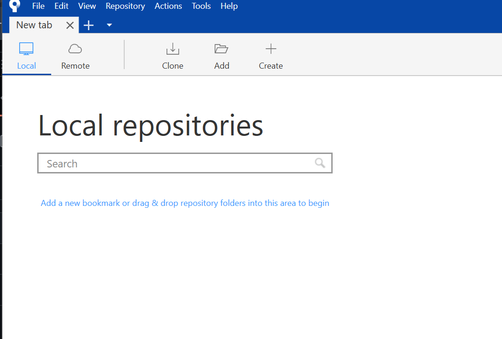

# 1. Definition of VCS
A Version Control System records changes over time.

_Key Features:_
- Time Travel: Revert to previous states.
- Branching: Work on independent lines.

# 2. Distributed VCS
Git is a DVCS where every local repo has full history.

_Advantages:_
- Offline Operations: Commit and branch without internet.
- Redundancy: Full backups on every client.

# 3. GitHub
A cloud service for Git repositories.

_Functions:_
- Sharing: Team access to code.
- Conflict Resolution: Tools for merging.

# 4. Necessity
- Efficiency: Automated syncing.
- Safety: History tracking.
- Scalability: Managing complexity.


# 5. Sourcetree
...

...
- GUI tool for git version control.


# 5. Git 환경 설정 (Environment Setup)

```bash
# Check current user name
git config --global user.name 

# Set user name
git config --global user.name "YuiseoYule" 

# Check current user email
git config --global user.email 

# Set user email
git config --global user.email "yule.yuiseo@gmail.com"

#global preference for naming of the primary branch
git config --global init.defaultBranch main
```

#Explanation
- git config: The tool used to set configuration variables that control how Git looks and operates.

- ----global: This flag indicates that the setting applies to all repositories for the current user (Hwang Yunseo) on this computer.

- init.defaultBranch: This is the specific configuration key that tells Git what name to give the initial branch when you run git init.

- main: This is the value being assigned to the key.

